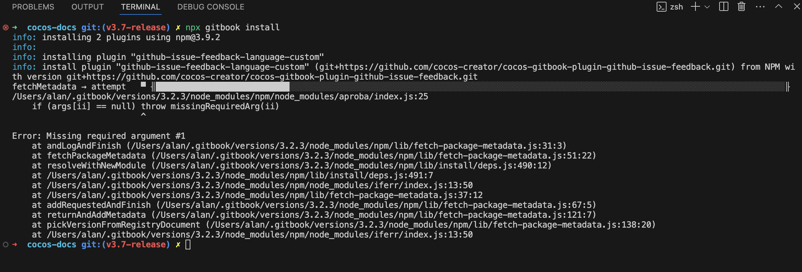
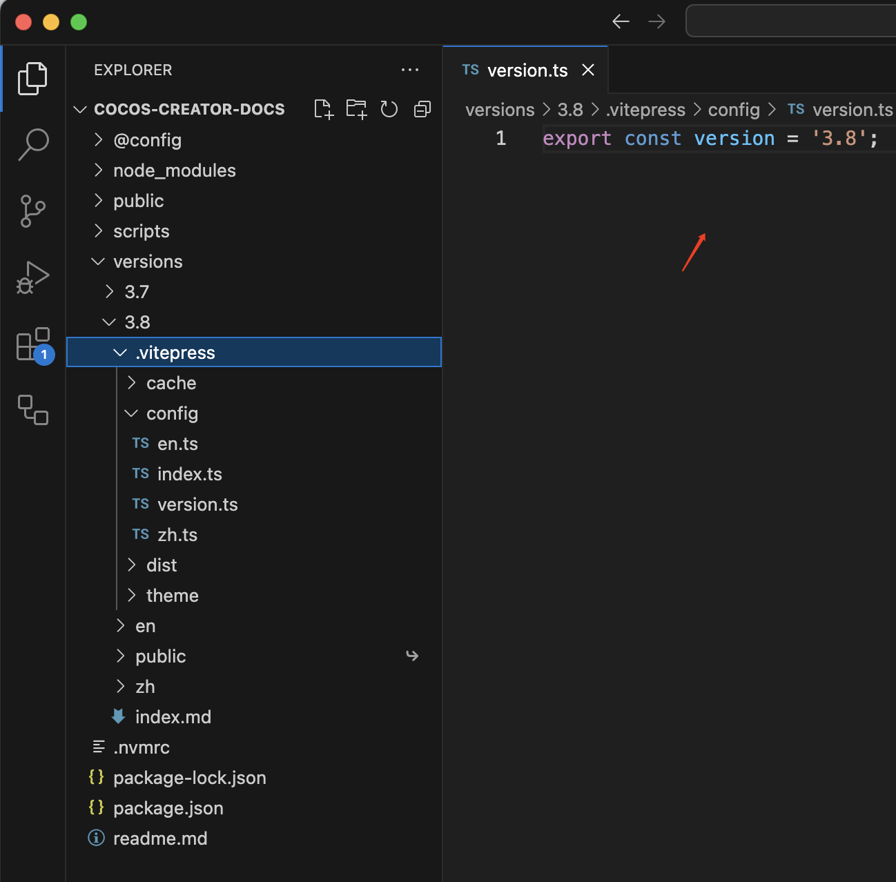
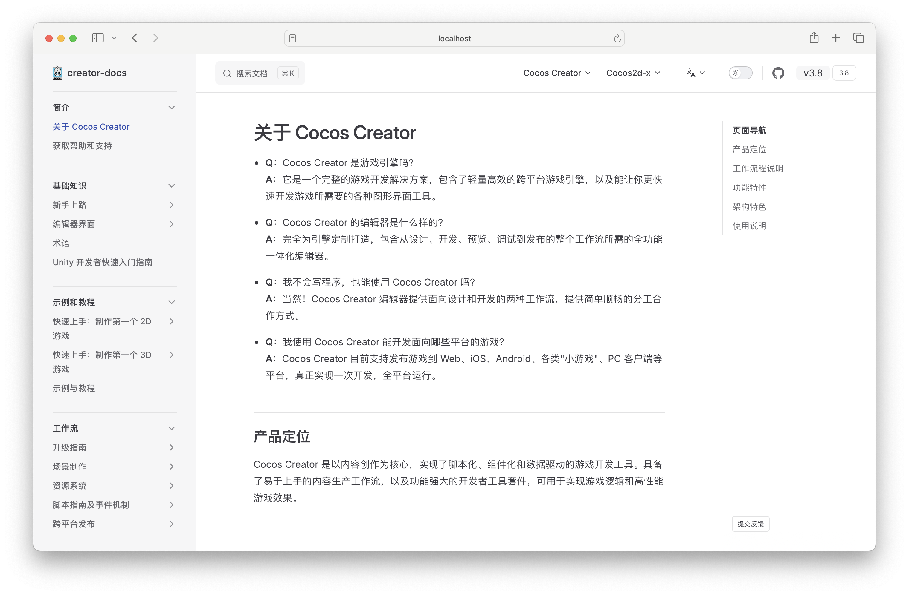
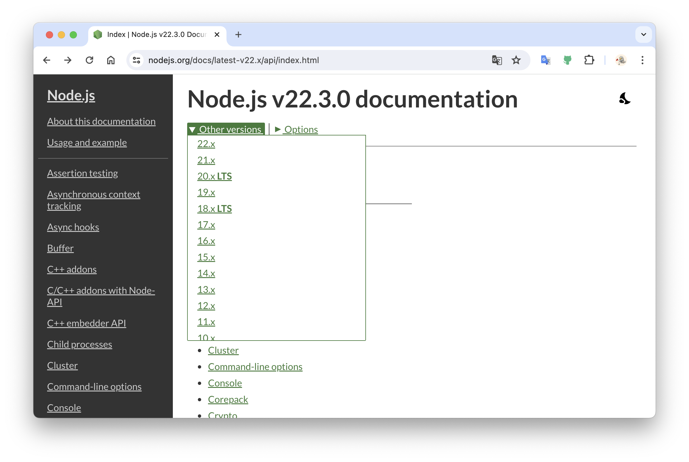
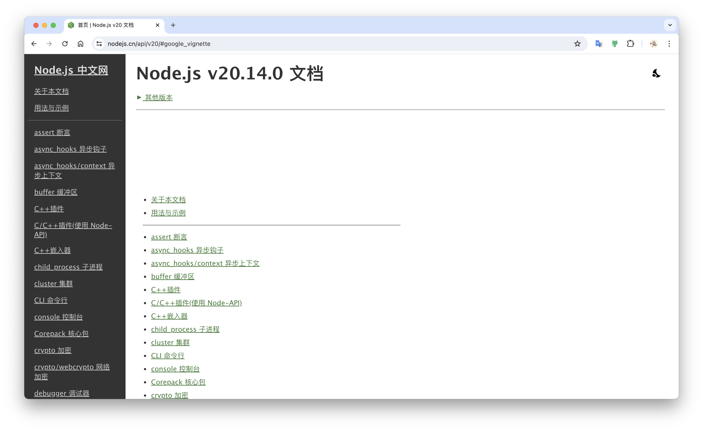
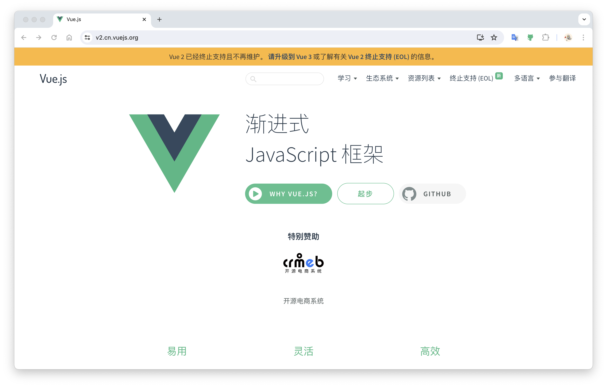
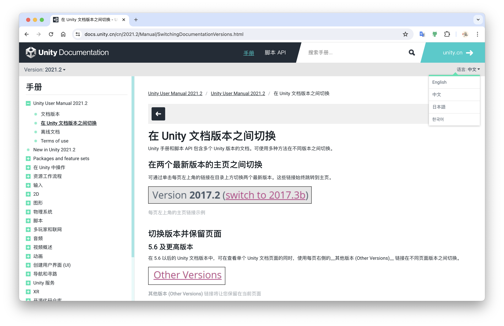
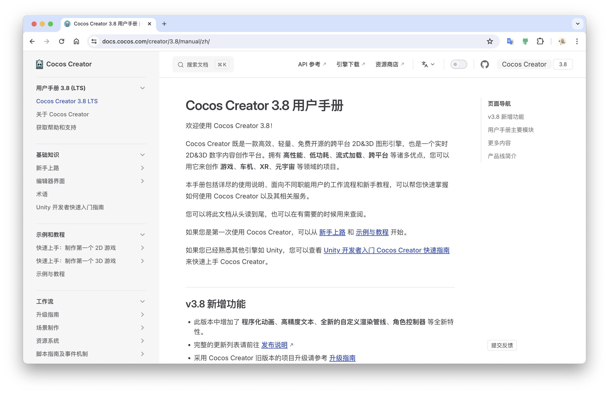

# 多版本多语言的文档系统设计

## 前言

本文记录了 cocos creator [用户手册](https://docs.cocos.com/creator/3.8/manual/zh/) 的重构过程中遇到的问题和解决方案，以及个人对多版本多语言的文档系统的可维护性的一些见解。

## 旧文档存在的问题

### 开源项目不再维护了

[用户手册](https://docs.cocos.com/creator/3.8/manual/zh/) 这个项目大约创建于 2017 年左右，当时选用的是 [GitBook](https://www.npmjs.com/package/gitbook-cli) 。目前该项目已经处于冻结状态，最后一次版本更新已经是 7 年前了(当前时间 2024.05.06)。官方已经将 [GitBook](https://www.gitbook.com/) 商业化，变成一个提供在线文档的服务平台。

当然，项目冻结不维护不是什么大问题（如果它依然稳定运行的话）哪怕我们为了它锁定 node 版本，甚至定制一个开发机器专门运行它也没关系，但是最近文档维护人员说项目启动不了。**(说明它不稳定，是个定时炸弹)**。

### 性能差

本地开发模式预览启动需要二十多分钟，构建发布也需要二十多分钟。

### 扩展性差

站在 2024 年这样的时间看 GitBook 的插件系统设计，显得不那么灵活和易用。

比如如果想对默认主题进行拓展和定制，不如 [vitepress](https://vitepress.dev/) 灵活方便。

比如它的插件下载并不是通过 npm 进行安装的，而是自己有一个 install 的流程，在前端工作流中显得有点割裂。而这次文档系统启动失败原因就是有个插件`突然`安装失败了。


### 多版本管理繁琐 （重点）

目前文档的多版本是通过 Git 的分支管理的


这就意味着如果我们修复以上的插件安装报错的问题，需要切到这 10 多个分支去依次提交同样的 PR，有点崩溃。而且这种崩溃在每次发布新版本的时候，都要经历一次。因为我们的文档中有个`版本列表`，它列举了所有已经发布的文档版本。具体配置在 `en/book.json` 和 `zh/book.json` 中:

```json
{
    "variables": {
        "version": [
            {
                "name": "3.7",
                "links": [
                    {
                        "name": "3.8",
                        "link": "https://docs.cocos.com/creator/3.8/manual/en"
                    },
                    {
                        "name": "3.7",
                        "link": "https://docs.cocos.com/creator/3.7/manual/en"
                    },
                    {
                        "name": "中间省略一堆版本"
                    },
                    {
                        "name": "1.10",
                        "link": "https://docs.cocos.com/creator/1.10/manual/en"
                    },
                    {
                        "name": "1.9",
                        "link": "https://docs.cocos.com/creator/1.9/manual/en"
                    }
                ]
            }
        ]
    }
}
```

查看截图右上角的版本下拉列表：

为了方便用户在阅读文档的时候切换不同的版本。

**假设我们要发布一个新版本 `3.9` 那么就需要切到 3.8 之前的所有分支，依次添加 3.9 的数据，重新构建文档进行发布。这是一件非常费时且无意义的工作。**

### 问题总结

-   文档依赖的 GitBook 已经是一个七年前就废弃的项目，且事实证明它不稳定，是个雷点
-   由于 GitBook 的技术老旧，每次构建起码要 25 分钟左右
-   后续想继续对文档系统进行功能拓展有一定困难
-   目前多版本管理的方式是以 git 的分支形式，不利于代码复用，新版本发布繁琐

## 重构方案

用 [vitepress](https://vitepress.dev/) 替代 Gitbook，它是一个极简且现代的文档构建框架，同样具备完善的插件体系，而且开箱即用的功能已经可以覆盖我们先有需求。

我们来剖析一下现有的文档具备的功能模块：


除了 `版本列表` 和 `问题反馈` 不是开箱支持，其他都是 viteprss 默认就提供的，而 `版本列表` 和 `问题反馈` 可以轻松的通过拓展默认主题来实现。

### 自定义主题

```ts
import { h } from 'vue';
import DefaultTheme from 'vitepress/theme';
import versionList from './versions-list.vue';
import feedback from './feedback.vue';
import { github } from '../config';

export default function (version: string) {
    return {
        extends: DefaultTheme,
        Layout() {
            return h(DefaultTheme.Layout, null, {
                'nav-bar-content-after': () =>
                    h(versionList, {
                        currentVersion: version,
                    }),
                'aside-ads-after': () =>
                    h(feedback, {
                        repo: github,
                    }),
            });
        },
    };
}
```

[vitepress](https://vitepress.dev/) 的默认主题提供了非常多且实用的插槽，我们可以轻松的拓展页面结构。

得益于 vitepress 的 [运行时 API](https://vitepress.dev/zh/reference/runtime-api#usedata)，我们在拓展问题反馈这个按钮的时候还可以直接带上当前文件的地址，方便快速定位到问题所在的文件。
<video controls src="./assets/fadeback.mov" />

### 多版本管理

我们直接废弃之前的 git 分支管理多版本，而采用文件夹的方式来隔离多版本。

新的项目结构如下：


-   `versions` 文件夹下面管理了所有版本，每个版本对应一个文件夹。
-   `@config` 文件夹维护了 vitepress 的公共配置，比如主题的定制等代码都在这边维护
-   `public` 是站点的公共数据，将它提出来不是必须的，但是提出之后，每个版本都用软连接访问它，可以极大的减少项目的体积。比如一张图片 1m，我们有文档发布了 20 个版本，那么它就有 20m，所以我这边将 public 挪到外面当作公共文件夹~

> 最终放弃通过软连接共享 public 的策略，因为在配置 .gitignore 的时候无法把这个软连接忽略，需要在工作流上做一些定制处理，为了项目的稳定性，不增加多余的噪音，还是直接每个版本文件夹里携带一份 public 文件夹吧。否则需要在 postinstall 的钩子生成软连接，然后在 commit 的钩子删除软连接，增加了理解和维护的成本。

每个文件夹代表一个版本，除了文档内容，里面只有一个 `config/version.ts` 是每个版本自定义的，用于标注版本信息，其他配置都是通过引用外面的 @config 的公共配置。


### 侧边栏导航的数据迁移

重构遇到最大的问题是之前 gitbook 的导航数据是配置在 `SUMMARY.md` 里，格式如下：

```md
# Summary

[Cocos Creator User Manual 3.8](index.md)

## Introduction

-   [About Cocos Creator](getting-started/introduction/index.md)
-   [Support](getting-started/support.md)

## Understanding the Basics

-   [Getting Started](getting-started/index.md)

    -   [Install and Launch](getting-started/install/index.md)
    -   [Dashboard](getting-started/dashboard/index.md)
    -   [Hello World!](getting-started/helloworld/index.md)
    -   [Project Structure](getting-started/project-structure/index.md)

-   [Editor Interfaces](editor/index.md)
    -   [Scene](editor/scene/index.md)
    -   [Hierarchy](editor/hierarchy/index.md)
    -   [Assets](editor/assets/index.md)
    -   [Inspector](editor/inspector/index.md)
    -   [Console](editor/console/index.md)
    -   [Preferences](editor/preferences/index.md)
    -   [Project Settings](editor/project/index.md)
    -   [Main Menu](editor/mainMenu/index.md)
    -   [Tool Bar](editor/toolbar/index.md)
    -   [Editor Layout](editor/editor-layout/index.md)
    -   [Preview & Debugging](editor/preview/index.md)
-   [Glossary](glossary/index.md)
-   [Cocos Creator Quick Guide for Unity Developers](./guide/unity/index.md)
```

但是 vitepress 的导航数据格式是一个 js 数组，格式如下：

```json
[
    {
        "text": "Introduction",
        "collapsed": false,
        "items": [
            {
                "text": "About Cocos Creator",
                "link": "getting-started/introduction/index.md"
            },
            {
                "text": "Support",
                "link": "getting-started/support.md"
            }
        ]
    }
]
```

由于每个版本的菜单配置有 500 多行数据，而且我们需要迁移将近 20 多个版本，所以人工手动迁移数据是不现实的，所以需要写个 node 脚本来转换菜单数据。

```js
import { readFile, writeFile, existsSync } from 'node:fs';
import { join, dirname } from 'node:path';

// 读取Markdown文件内容
function readMarkdownFile(filePath) {
    return new Promise((resolve, reject) => {
        readFile(filePath, 'utf8', (err, data) => {
            if (err) reject(err);
            else resolve(data);
        });
    });
}

const list = [];

function countLeadingSpaces(str) {
    const match = str.match(/^\s*/); // 匹配字符串前面的空格
    return match ? match[0].length : 0;
}

function extractContent(str) {
    // 匹配中括号内容
    const bracketRegex = /\[([^\]]*)\]/;
    // 匹配圆括号内容
    const parenthesesRegex = /\((.*?)\)/;

    // 使用正则表达式的exec方法查找匹配项
    const bracketMatch = bracketRegex.exec(str);
    const parenthesesMatch = parenthesesRegex.exec(str);

    // 提取并返回匹配的内容
    const text = bracketMatch ? bracketMatch[1] : undefined;
    const link = parenthesesMatch ? parenthesesMatch[1] : undefined;

    return {
        text,
        link,
    };
}

function getLast(list) {
    return list[list.length - 1];
}

function pushItem(parent, item) {
    if (Array.isArray(parent.items)) {
        parent.items.push(item);
    } else {
        parent.items = [item];
    }
    // 一级菜单配置了 collapsed = false，其他层级需要默尔收起折叠
    parent.collapsed ??= true;
}

function parseMarkdownToJSON(str) {
    const lines = str.split('\n').filter((v) => {
        // 只保留 ## 和 - 开头的内容
        return /^(##|\s*-)/.test(v);
    });

    for (let line of lines) {
        if (line.startsWith('##')) {
            list.push({
                text: line.replace('##', '').trim(),
                collapsed: false,
                items: [],
            });
        } else if (line.trim().startsWith('-')) {
            const count = countLeadingSpaces(line);
            if (count % 4 !== 0) {
                console.error(line, '格式错误，请确保 4 个空格的缩进');
                return;
            }
            let level = count / 4;
            const item = extractContent(line);

            switch (level) {
                case 0:
                    pushItem(getLast(list), item);
                    break;
                case 1:
                    pushItem(getLast(getLast(list).items), item);
                    break;
                case 2:
                    pushItem(getLast(getLast(getLast(list).items).items), item);
                    break;
                case 3:
                    pushItem(getLast(getLast(getLast(getLast(list).items).items).items), item);
                    break;
                case 4:
                    pushItem(getLast(getLast(getLast(getLast(getLast(list).items).items).items).items), item);
                    break;
                case 5:
                    pushItem(getLast(getLast(getLast(getLast(getLast(getLast(list).items).items).items).items).items), item);
                    break;
                default:
                    break;
            }
        } else {
            console.warn(line + 'is not available!');
        }
    }
    return list;
}

// 主函数
async function main() {
    const root = process.cwd();
    // 在 vscode 上，找到 SUMMAEY.md , 右键复制相对路径 当作该脚本的执行参数
    const summaryFile = process.argv[2] || 'undefine';
    const summaryFilePath = join(root, summaryFile);

    if (!existsSync(summaryFilePath)) {
        return console.log(summaryFile + 'is not exist!');
    }

    try {
        const __dirname = dirname(summaryFilePath);
        const markdownContent = await readMarkdownFile(summaryFilePath);
        const jsonData = parseMarkdownToJSON(markdownContent);

        // 删除需要隐藏的导航
        ['CC_HIDE_IN_SUMMARY_START', 'CC_HIDE_IN_SUMMARY_END'].forEach((text) => {
            const i = jsonData.findIndex((v) => v.text === text);
            if (i !== -1) {
                jsonData.splice(i, 1);
            }
        });

        writeFile(join(__dirname, 'summary.json'), JSON.stringify(jsonData, null, 4), function () {});
    } catch (error) {
        console.error('Error:', error);
    }
}

main();
```

在迁移的时候只需要执行：

```bash
node ./scripts/create-sidebar.js versions/3.7/en/SUMMARY.md
```

它将会在同级目录生成一个 `summary.json` 的文件，里面是符合 vitepress 的导航数据格式。

### 多版本列表

原来的多版本列表是在构建文档的时候使用静态数据的，导致每次发布新版本，都需要去重新构建，所以这块数据最好是使用动态拉取的，我们在 oss 维护一份 versions.json 数据，在访问文档的时候动态拉取，这样后期增加新版本就可以及时更新且不用重新构建之前的版本。

### 全局变量的替换

旧文档中使用了 `__APIDOC__` 这样的占位字符串，在构建的时候替换成了对应的在线地址，因为它需要区分测试环境和正式环境。

在 vitepress 中虽然没有环境变量的配置，不过我们可以通过编写 markdown-it 的插件来实现，具体可以看这个 PR: [feat: 支持通过 env 文件替换全局变量](https://github.com/cocos/cocos-docs/pull/2928)

## 成果

下图是通过 vitepress 重构过的文档系统：


我们完整的实现了现有的所有功能，是的，那个 `社交分享` 被我忽略了，因为我觉得这是一个一厢情愿的功能，几乎不会有人会将文档地址分享到自己的社交账号去的，没必要在这边多一个摆设，文档系统就应该是页面简洁且聚焦。

而且带来的如下优势：

-   省略了 gitbook install 的缓慢环节
-   启动速度从之前的 20 多分钟，直接提到了不到 1 分钟
-   多版本在同一个分支维护，可以共用基础代码
-   版本列表以动态数据呈现，发布新版本不用重新构建旧版本
-   美观度也提升不少
-   得益于 vitepress 默认主题的多端适配，我们的移动端体验也有了巨大的提升

## 发布

我们先来看下一般`多版本多语言`的文档系统会以什么形式发布。

### 根据国家部署不同域名

-   https://nodejs.org/docs/latest/api/
-   https://nodejs.cn/api/

比如 nodeJs 的文档，感觉这个是最不推荐的部署方式，首先成本较大，需要申请所有国家的域名。而且服务器的运维成本也会增加。

当然 nodeJs 的多语言是这样是因为官方其实只提供了英文文档，中文文档是国人自行翻译的。其实并不是一个主体。




### 根据国家和版本部署不同的子域名

-   https://v2.cn.vuejs.org
-   https://cn.vuejs.org
    
    

优点是可以更突出版本和语言，vue 采用这种方式是因为它的文档的版本发布本来就是低频操作，它们只有发布大版本，才需要不同的路径来区分版本。而且它们不同版本的文档内容会有非常大的变化，所以会以版本的维度也进行一个子域名解析。

缺点就是它只适合版本不会很多的文档，否则维护域名解析都有一串长长的列表，还有 https 证书什么的也要重复申请。

### 根据路径来区分版本和语言

-   https://docs.unity.cn/cn/2023.1/Manual/Input.html
-   https://docs.cocos.com/creator/3.8/manual/zh/



