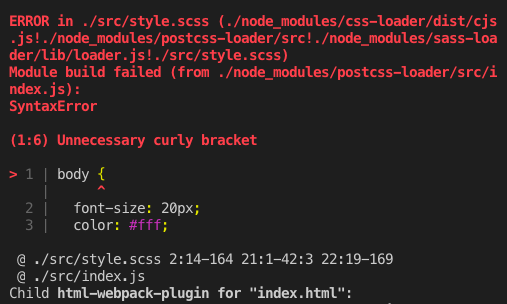
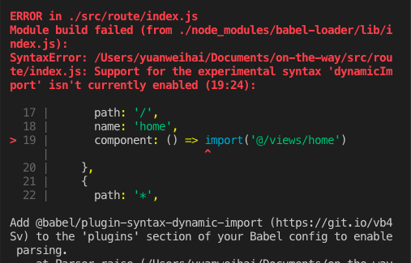

# webpack 配置笔记

## scss 编译


```javascript
module.exports = ctx => {
  return {
    // parser: 'sugarss', // 注释掉
    map: ctx.env === 'development' ? ctx.map : false,
    plugins: {
      'postcss-import': {},
      'postcss-cssnext': {},
      'cssnano': {}
    }
  }
}
```

## 动态导入文件



需要安装 babel 插件
```bash
npm install @babel/plugin-syntax-dynamic-import
```